# 📚 Library Management System

A professional desktop application for managing library operations, built with **.NET 10**, **WinForms**, **ADO.NET**, and **SQL Server** using the **3-Tier Architecture**.

---

# Features

* User Authentication
* Role-Based Authorization (Admin / Librarian)
* Books Management
* Members Management
* Categories Management
* Users Management
* Borrow & Return Books
* Dashboard
* Reports
* Export Reports to Excel
* Export Reports to PDF

---

# Technologies

* .NET 10
* WinForms
* C#
* ADO.NET
* SQL Server
* T-SQL
* Stored Procedures
* Views
* Triggers
* ClosedXML
* QuestPDF

---

# Project Structure

```text
LibraryManagementSystem
│
├── Database
├── Library.Models
├── Library.DataAccess
├── Library.Business
├── Library.UI
└── README.md
```

---

# Database Setup

## Option 1: Restore Backup (.bak)

1. Open **SQL Server Management Studio (SSMS)**.
2. Connect to your SQL Server instance.
3. Right-click **Databases**.
4. Select **Restore Database...**
5. Choose **Device**.
6. Browse to the backup file located in:

```text
Database/LibraryDatabase.bak
```

7. Click **OK**.
8. Wait until the restore process finishes successfully.

---

## Option 2: Execute SQL Script

If you are using the SQL script instead of the backup:

1. Open **SQL Server Management Studio (SSMS)**.
2. Create a new database named:

```text
LibraryDB
```

3. Open the following file:

```text
Database/LibraryDatabase.sql
```

4. Execute the script.

This script creates:

* Tables
* Relationships
* Constraints
* Views
* Triggers
* Stored Procedures
* Sample Data

---

# Configure the Connection String

Open:

```text
Library.DataAccess/Database.cs
```

Update the connection string to match your SQL Server instance.

Example:

```text
Server=YOUR_SERVER_NAME;
Database=LibraryDB;
Trusted_Connection=True;
TrustServerCertificate=True;
```

If you are using SQL Server Authentication:

```text
Server=YOUR_SERVER_NAME;
Database=LibraryDB;
User Id=YOUR_USERNAME;
Password=YOUR_PASSWORD;
TrustServerCertificate=True;
```

---

# Run the Application

1. Open the solution in **Visual Studio 2022**.
2. Restore NuGet packages.
3. Build the solution.
4. Set **Library.UI** as the Startup Project.
5. Press **F5** or click **Start**.

---

# Default Login

If you included sample users in the database:

```text
Username : admin

Password : admin123
```

> Change these credentials if your sample database uses different values.

---

# Reports

The application supports:

* Books Report
* Members Report
* Borrowings Report
* Overdue Books Report

Reports can be exported to:

* PDF
* Excel

---

# Screenshots

* Login
* 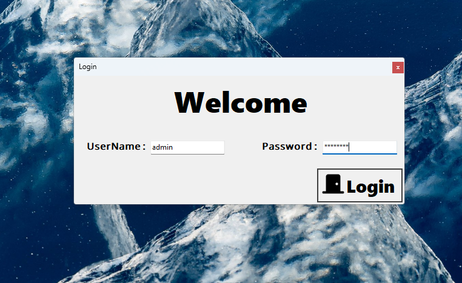
* Dashboard
* 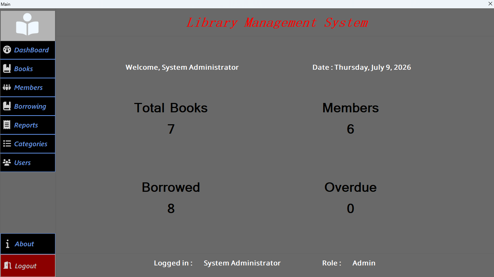
* 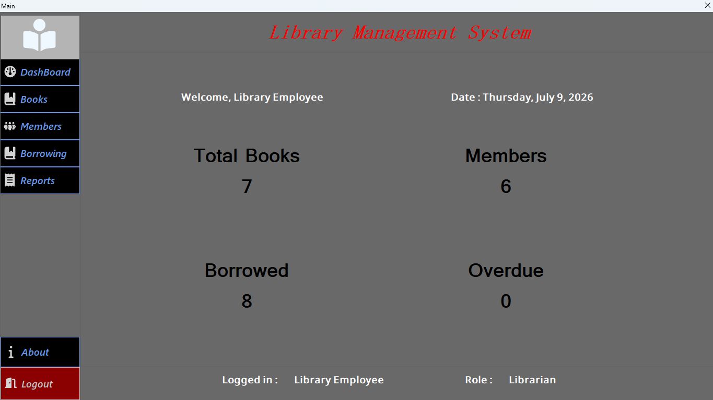
* Books
* 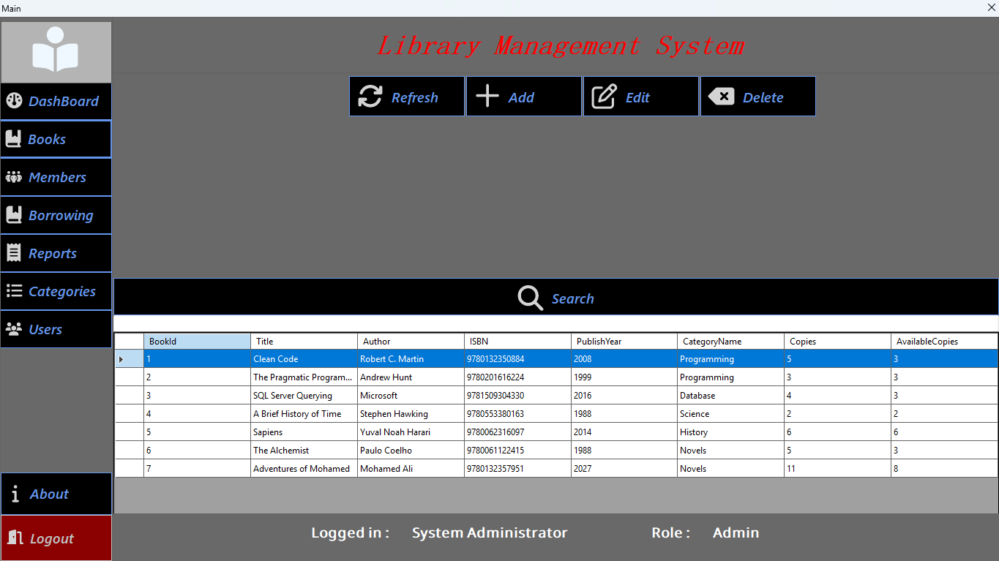
* 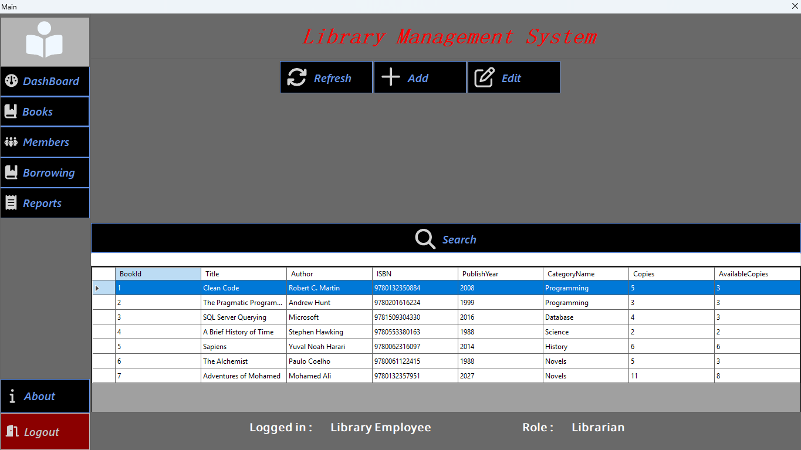
* BookDetails
* 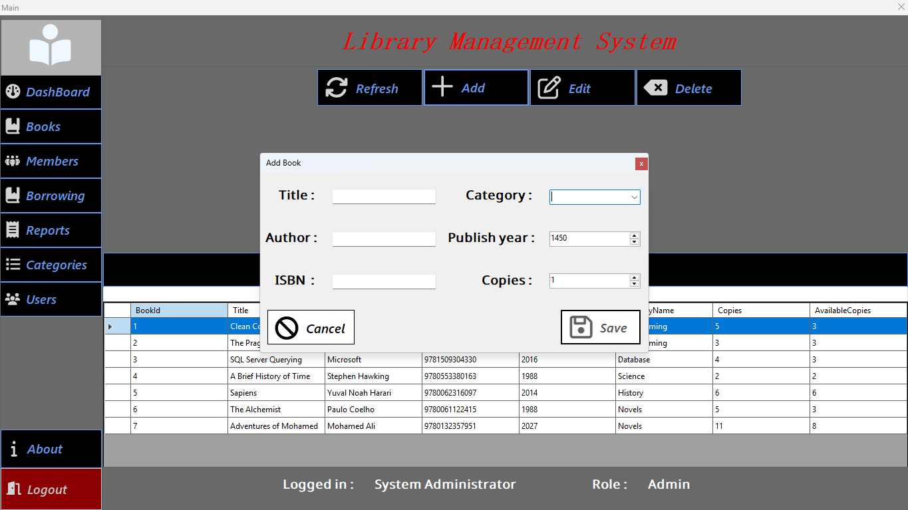
* Members
* 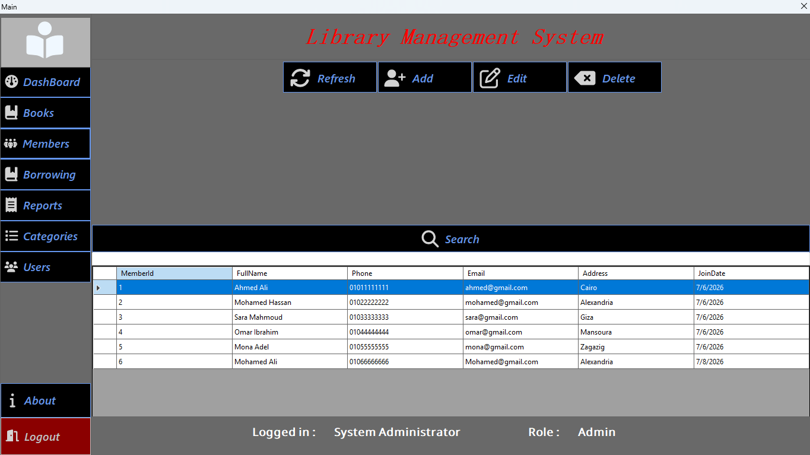
* 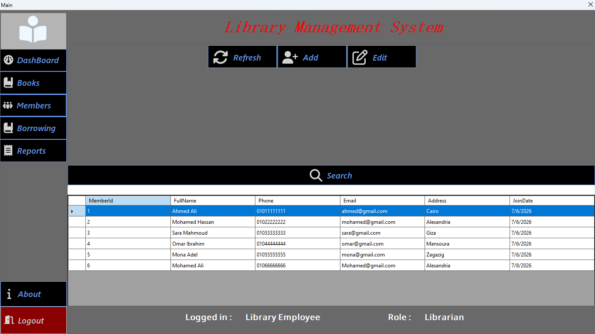
* MemberDetails
* 
* Categories
* 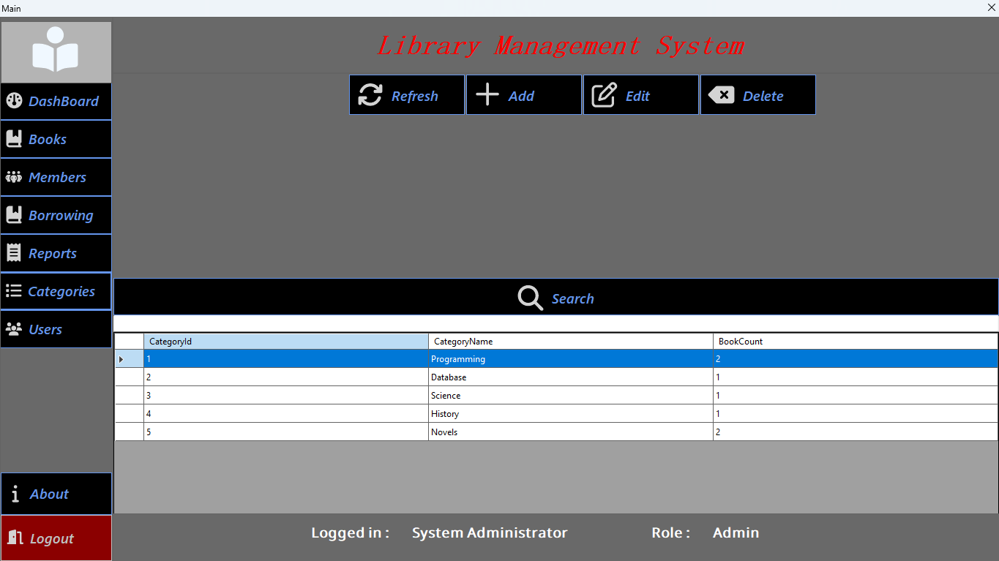
* Users
* 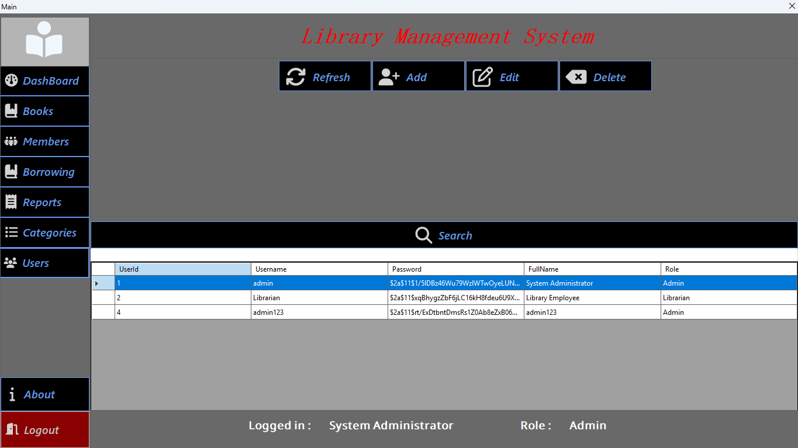
* UserDetails
* 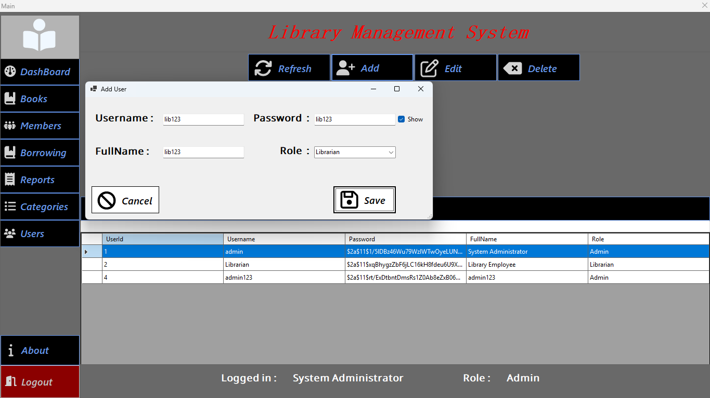
* Borrowings
* 
* 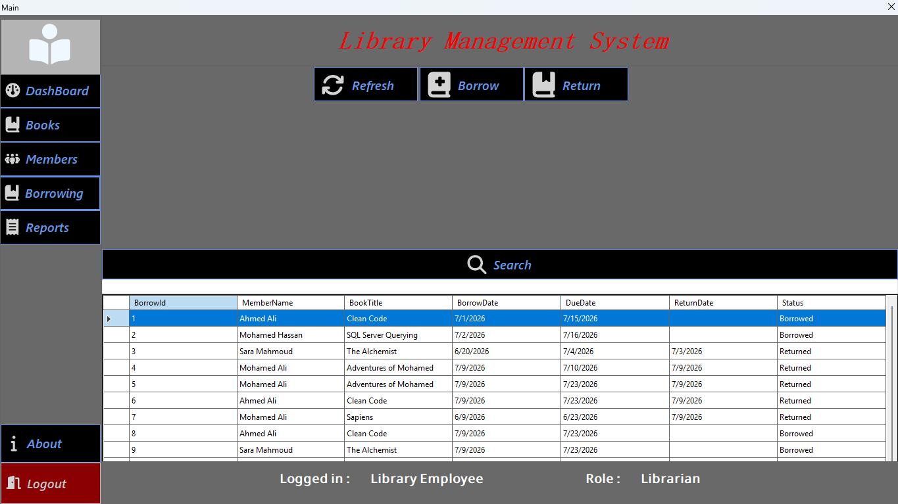
* Borrow
* 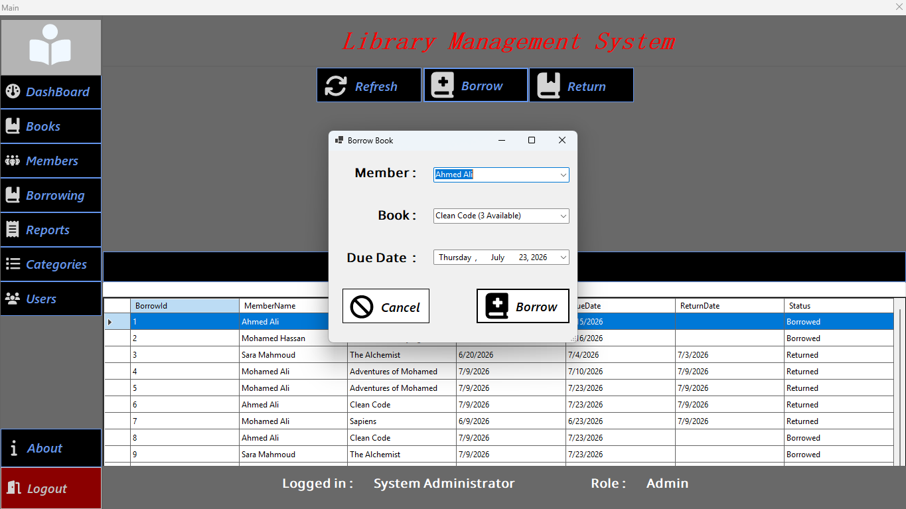
* Reports
* 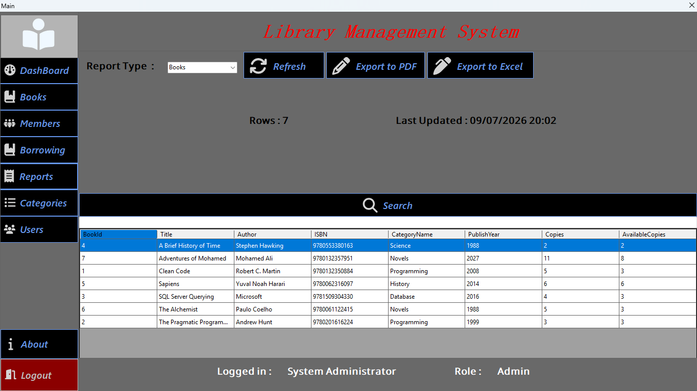
* 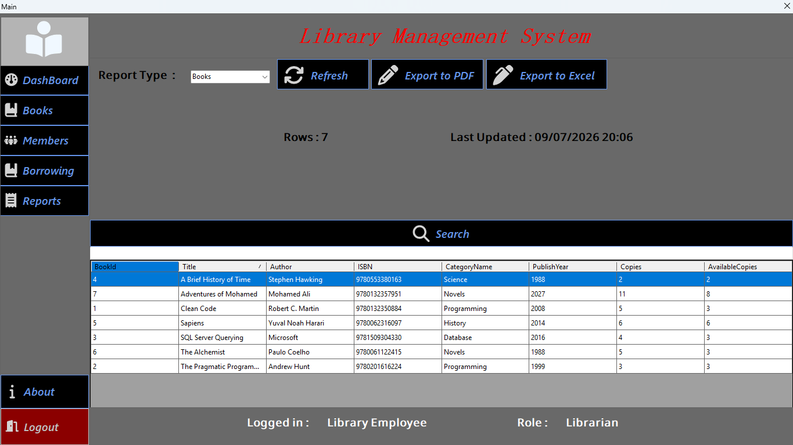
---

# Future Improvements

* Audit Logging
* Dashboard Charts
* Backup & Restore
* Dark Mode
* Barcode Scanner Support

---

# Author

Developed by **Abdullah A.**

---

# License

This project is provided for educational and portfolio purposes.
